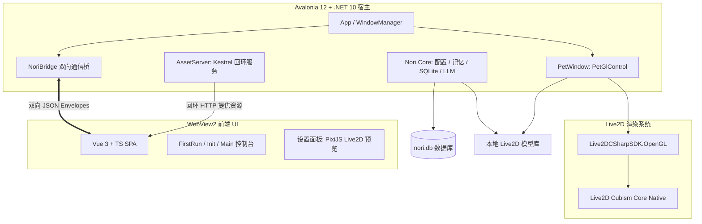

<div align="center">

# Nori Desktop Pet

<p align="center">
  <strong>基于 .NET 10 + Avalonia 12 原生宿主与 Vue 3 + WebView2 架构的新一代高性能 Live2D 桌面智能伴侣</strong>
</p>

<p align="center">
  <a href="https://deepwiki.ai/MF-Dust/Nori-Desktop-Pet"></a>
  <a href="https://dotnet.microsoft.com/"></a>
  <a href="https://avaloniaui.net/"></a>
  <a href="https://vuejs.org/"></a>
  <a href="https://www.typescriptlang.org/"></a>
  <a href="https://www.live2d.com/"></a>
  <a href="./LICENSE"></a>
  <a href="https://github.com/MF-Dust/Nori-Desktop-Pet/pulls"></a>
  <a href="https://github.com/MF-Dust/Nori-Desktop-Pet/stargazers"></a>
  <a href="https://github.com/MF-Dust/Nori-Desktop-Pet/network/members"></a>
</p>

[DeepWiki 知识库](https://deepwiki.ai/MF-Dust/Nori-Desktop-Pet) · [快速上手](#快速上手) · [系统架构](#系统架构) · [贡献指南](#开发与贡献约定)

</div>

---

## 项目简介

**Nori Desktop Pet** 是一款兼具高颜值与高智能的二次元桌面宠物程序。

底层宿主采用 **.NET 10 + Avalonia 12** 构建，桌宠渲染采用 **C# 原生 OpenGL ES (Live2DCSharpSDK)** 实现逐像素透明透出桌面与无死角鼠标拖拽交互；主控制面板与设置界面采用现代化的 **Vue 3 + TypeScript + Less** SPA 并由 **WebView2** 高性能承载。

### 核心特性

- **原生 OpenGL Live2D 桌宠**：基于 `Live2DCSharpSDK` 直接在 Avalonia `PetGlControl` (OpenGL ES 2.0) 上绘制，支持高精度 2048x2048 遮罩缓冲与 16x 各向异性过滤，原生支持物理摆动、自动眨眼、视线追踪、节拍同步与口型同步。
- **像素级透明穿透与原生手感**：Alpha 缓冲动态采样（~10Hz）结合 Win32 `WM_NCHITTEST`，实现透明区域鼠标事件真实穿透至桌面底层；4px 阈值原生平滑拖拽与坐标持久化。
- **智能 AI 对话与大模型接入**：支持 OpenAI / Claude / Gemini / Ollama / DeepSeek 等多平台 LLM，具备流式打字机输出与情感/动作标记驱动。
- **本地记忆与 MCP 工具扩展**：内置基于 SQLite 的 Key-Value 与短期/长期记忆管理，支持 Model Context Protocol (MCP) 扩展插件生态。
- **本地模型自由管理与预览**：一键导入本地 Live2D ZIP/文件夹，在设置面板中通过 PixiJS 进行实时 3D/2D 视口渲染与缩放/位置/行为参数热调节。
- **完备的国际化与深海微光美学**：全界面中英文双语支持（i18n），精心调配的深海微光流体毛玻璃质感 UI 与原生快捷托盘右键菜单。

---

## 系统架构



---

## 仓库目录结构

```
Nori-Desktop-Pet/
├── app/desktop/                     # 桌宠主程序根目录
│   ├── Nori.Desktop/                # Avalonia 12 宿主（窗口调度/系统托盘/IPC 桥接）
│   ├── Nori.Core/                   # 纯逻辑核心层（SQLite 数据库/LLM 客户端/资源服务）
│   ├── Nori.Core.Tests/             # .NET 单元测试套件（xUnit）
│   ├── Live2DCSharpSDK.Framework/   # Live2D Cubism Framework C# 实现
│   ├── Live2DCSharpSDK.OpenGL/      # Live2D OpenGL ES 2.0 渲染器
│   ├── Live2DCSharpSDK.App/         # Live2D 模型与纹理加载管理
│   ├── Live2D/native/               # 各平台 Cubism Core 原生动态库 (Windows/macOS/Linux/Android)
│   ├── src/                         # 前端 Vue 3 + TypeScript SPA 源码
│   │   ├── components/              # Vue 组件（聊天/设置/首页/首次引导）
│   │   ├── services/                # 前端服务（Host IPC 桥/Live2D 控制器/i18n/Agent）
│   │   └── views/                   # 窗口视图（FirstRunView / InitView / Main）
│   ├── tests/                       # 前端 Vitest 单元测试
│   ├── package.json                 # 前端依赖与脚本配置
│   ├── pnpm-workspace.yaml          # pnpm 工作区配置
│   └── vite.config.ts               # Vite 构建配置
├── docs/                            # 架构设计文档与开发规范
│   ├── 规范.md                      # 必须遵守的代码与风格契约
│   ├── 技术.md                      # 模块技术图谱与透明度验证记录
│   ├── windows.md                   # Avalonia 窗口属性与配置参考
│   └── 开发任务清单.md              # 研发里程碑与任务清单
├── README.md                        # 项目说明文档
└── CLAUDE.md                        # AI 编码助手与架构规范指南
```

---

## 快速上手

### 环境要求

- **操作系统**：Windows 10 / 11（x64）
- **.NET SDK**：[.NET 10.0 SDK](https://dotnet.microsoft.com/download/dotnet/10.0) 或更高版本
- **Node.js**：Node.js 18+ 与 [pnpm](https://pnpm.io/)（必须使用 pnpm）
- **运行时环境**：WebView2 Runtime（Windows 10/11 绝大多数已内置）

### 安装与运行

1. **克隆仓库**

```bash
git clone https://github.com/MF-Dust/Nori-Desktop-Pet.git
cd Nori-Desktop-Pet/app/desktop
```

2. **安装前端依赖**

```bash
pnpm install
```

3. **运行测试与构建**

```bash
pnpm build              # 前端 TypeScript 检查与打包
dotnet build            # 构建 C# 宿主与核心库
dotnet test             # 运行全部 .NET 单元测试
pnpm test               # 运行全部前端 Vitest 测试
```

4. **启动应用**

- **生产模式（推荐）**：使用内置 Kestrel 服务器托管构建后的 `dist` 前端资源

```bash
dotnet run --project Nori.Desktop
```

- **开发热重载模式**：先启动 Vite 开发服务器，再启动宿主指向热重载端口

```bash
# 终端 1：启动 Vite 开发服务（端口 1420）
pnpm dev

# 终端 2：启动宿主并指定开发环境变量
NORI_DEV=1 dotnet run --project Nori.Desktop
```

5. **独立打包发布**

在 `app/desktop/` 下执行：

```cmd
publish.bat
```

产物将输出至 `app/desktop/bin/publish/win-x64/`。

---

## 开发与贡献约定

在提交代码前，请务必阅读 [`docs/规范.md`](./docs/规范.md)。主要约定包括：

- **代码风格**：
  - 前端（`.ts` / `.vue` / `.less`）与 C# 源码缩进统一采用 **Tab**，双引号，换行符使用 **LF**。
  - 前端局部常量采用 `UPPER_SNAKE` 命名规范（如 `const ROUTER = useRouter()`），C# 遵循标准 .NET 命名风格。
  - 注释、日志提示和面向用户的界面文本保持**中文**。
- **质量门禁**：
  - 每次 PR 前必须确保 `pnpm build`、`pnpm test` 和 `dotnet test` 全部无警告/无错误通过。
- **窗口与命令规范**：
  - 新增窗口需同步更新 `WindowDefinition.cs`、`WindowLabel`、`WINDOW_ROUTES` 与 `router/index.ts`。
  - 新增桥接 IPC 命令需在 `BridgeCommands.InvokeAsync` 显式注册。

---

## 文档与 DeepWiki

更详细的技术选型分析、透明窗口采样本、通信协议设计及开发任务规划，请参阅：

- [DeepWiki 知识库](https://deepwiki.ai/MF-Dust/Nori-Desktop-Pet)
- [技术架构设计 (docs/技术.md)](./docs/技术.md)
- [编码与开发规范 (docs/规范.md)](./docs/规范.md)
- [窗口属性与透明度参考 (docs/windows.md)](./docs/windows.md)
- [任务清单 (docs/开发任务清单.md)](./docs/开发任务清单.md)

---

## Star History

<div align="center">

<a href="https://star-history.com/#MF-Dust/Nori-Desktop-Pet&Date">
 <picture>
   <source media="(prefers-color-scheme: dark)" srcset="https://api.star-history.com/svg?repos=MF-Dust/Nori-Desktop-Pet&type=Date&theme=dark" />
   <source media="(prefers-color-scheme: light)" srcset="https://api.star-history.com/svg?repos=MF-Dust/Nori-Desktop-Pet&type=Date" />
   
 </picture>
</a>

</div>

---

## 开源许可证

本项目基于 [GNU General Public License v3.0 (GPLv3)](./LICENSE) 协议开源。欢迎参与贡献、提交 Issue 或发起 Pull Request！

## 当前稳定化口径

普通构建的产品版本精确为 `Dev`；GitHub Actions Release 手动输入唯一 codename，并以数字版本和短提交 hash 派生稳定标签、Sentry release 与 informational version。开发门禁：

```bash
cd app/desktop
pnpm install
pnpm build
pnpm test
dotnet build Nori.slnx
dotnet test Nori.slnx
```

发布为 framework-dependent；Windows 需要 .NET 10 Runtime 与 WebView2。模型只支持本地导入，不提供远程模型下载。出现启动问题时可人工使用 `--safe-mode`，它保留诊断和手动修复入口，不会自动恢复或删除用户数据。
