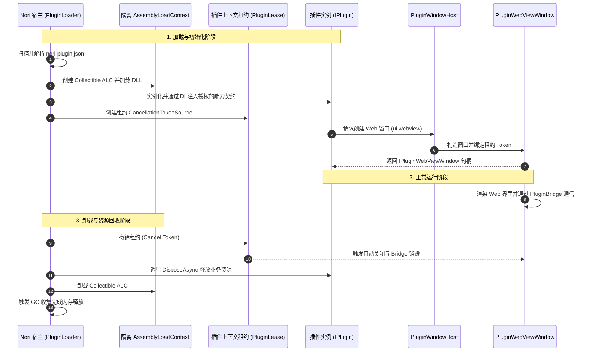
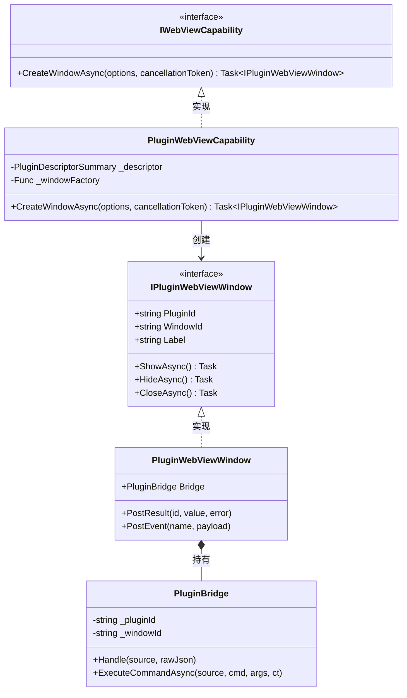
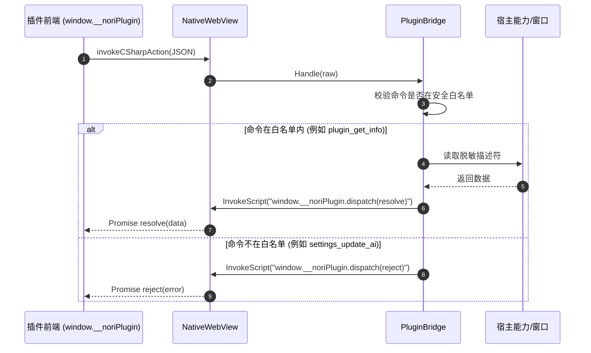

# Nori 插件系统规范 1.0 (NPS 1.0) 架构与 Web 宿主实现

> 本文描述 Nori 桌面宠物插件系统规范 1.0 (Nori Plugin Specification 1.0, NPS 1.0) 的体系设计、安全边界模型、第一阶段 (Phase 1) Web-facing 宿主层实现以及后续阶段演进路线。

---

## 目录

- [1. 体系设计与架构愿景](#1-体系设计与架构愿景)
- [2. 第一阶段 Web 宿主层实现](#2-第一阶段-web-宿主层实现)
  - [2.1 动态插件窗口管理器 (PluginWindowHost)](#21-动态插件窗口管理器-pluginwindowhost)
  - [2.2 隔离 Web 视图窗口 (PluginWebViewWindow)](#22-隔离-web-视图窗口-pluginwebviewwindow)
  - [2.3 Web 视图能力契约 (PluginWebViewCapability)](#23-web-视图能力契约-pluginwebviewcapability)
  - [2.4 独立安全桥接总线 (PluginBridge)](#24-独立安全桥接总线-pluginbridge)
  - [2.5 开发环境代理配置](#25-开发环境代理配置)
- [3. 安全模型与边界契约](#3-安全模型与边界契约)
  - [3.1 进程内受信任执行与 ALC 定位](#31-进程内受信任执行与-alc-定位)
  - [3.2 Web 视图隔离与数据沙盒](#32-web-视图隔离与数据沙盒)
  - [3.3 身份绑定与防伪造机制](#33-身份绑定与防伪造机制)
  - [3.4 路径与敏感数据脱敏](#34-路径与敏感数据脱敏)
  - [3.5 极窄命令白名单与主桥隔离](#35-极窄命令白名单与主桥隔离)
- [4. 系统架构与交互时序图](#4-系统架构与交互时序图)
  - [4.1 插件包与目录结构](#41-插件包与目录结构)
  - [4.2 插件完整生命周期时序](#42-插件完整生命周期时序)
  - [4.3 能力注入与解耦模型](#43-能力注入与解耦模型)
  - [4.4 插件前端通信时序](#44-插件前端通信时序)
- [5. 未实现规范与后续里程碑 (Phase 2 & Phase 3)](#5-未实现规范与后续里程碑-phase-2--phase-3)

---

## 1. 体系设计与架构愿景

Nori 插件系统旨在为桌面端提供模块化、可插拔的功能扩展体系，使开发者能够为桌宠带来丰富的自定义交互、小组件、外挂工具以及自定义渲染行为。

系统遵循以下核心设计原则：
1. **高性能与低开销**：C# 核心采用原生 .NET 进程内架构，杜绝多进程 IPC 的沉重序列化开销；
2. **最小特权与解耦**：插件无法直接接触 `AppServices`、`NoriBridge` 或底层原生窗口调度器，所有功能均通过受限的能力（Capability）接口由宿主显式注入；
3. **独立 Web 视图与视觉一致性**：插件可通过 `ui.webview` 能力按需创建独立的透明无边框 Web 视图窗口，延续深海微光（Deep Ocean Glow）视觉设计系统；
4. **生命周期租约管理**：插件资源（窗口、定时器、事件监听）强绑定插件上下文租约（Lease），插件卸载或禁用时自动级联注销与回收。

---

## 2. 第一阶段 Web 宿主层实现

第一阶段已完整落地 Web-facing 宿主层核心骨架，位于 `Nori.Desktop/Plugins/`：

```
Nori.Desktop/Plugins/
├── PluginAbstractions.cs        # Nori.Plugin.Abstractions 核心契约与接口
├── PluginDescriptorSummary.cs   # 供 Web/桥接读取的脱敏插件描述符摘要
├── PluginBridge.cs              # 插件专用独立安全桥接总线
├── PluginWebViewWindow.cs       # 承载插件 Web 视图的独立 Avalonia 窗口
├── PluginWindowHost.cs          # 动态插件窗口管理器 (隔离于四固定窗口)
└── PluginWebViewCapability.cs    # [PluginCapability("ui.webview")] 能力实现
```

### 2.1 动态插件窗口管理器 (PluginWindowHost)

- **独立于固定窗口**：主程序通过 `WindowDefinition.All` 维护 4 个固定生命周期窗口（`first-run`、`init`、`main`、`pet`），而 `PluginWindowHost` 专门维护动态创建的插件窗口，互不干扰；
- **全局标签命名空间**：所有插件窗口必须遵循 `plugin:<pluginId>:<windowId>` 的确定性标签格式（例如 `plugin:weather-plugin:settings-view`）；
- **严格标识校验**：`PluginWindowHost.ValidateId` 强制要求 ID 仅由 1-64 位字母、数字、下划线、短横线与点组成（`^[a-zA-Z0-9_\-\.]{1,64}$`），杜绝 `..` 路径穿越、`/` 与 `\` 目录分隔符、冒号 `:` 以及控制字符注入；
- **全生命周期管理**：提供窗口创建、根据标签或插件 ID 查询、按插件批量关闭（`CloseAllWindowsForPluginAsync`）以及退出时全量清空能力。

### 2.2 隔离 Web 视图窗口 (PluginWebViewWindow)

- **Avalonia 原生透明窗口**：沿用 Nori 的透明玻璃渲染规范（`TransparencyLevelHint = [WindowTransparencyLevel.Transparent]`、`Background = Brushes.Transparent`）；
- **跨平台标题栏适配**：当平台支持原生无缝拖拽时采用 `WindowDecorations.None`，在不支持的平台（如部分 Wayland 环境）优雅回退至系统原生边框；
- **隔离的 NativeWebView 环境**：每个插件窗口拥有独立的 `NativeWebView` 实例，WebView 用户数据目录隔离至 `data/webview_plugins/<pluginId>`；
- **租约撤销联动**：构造时绑定 `revocationToken`，插件上下文被撤销或注销时，自动在 UI 线程调度关闭窗口并清理桥接资源；
- **严格 UI 线程调度**：所有窗口属性读写与脚本执行均严格经过 `Dispatcher.UIThread`。

### 2.3 Web 视图能力契约 (PluginWebViewCapability)

- **能力特性标记**：带有 `[PluginCapability("ui.webview")]` 特性，实现 `IWebViewCapability` 接口；
- **工厂委托解耦**：构造时接收宿主注入的窗口工厂委托 `Func<PluginDescriptorSummary, PluginWebViewOptions, CancellationToken, Task<IPluginWebViewWindow>>`，本身不持有任何 `AppServices` 引用；
- **前置防御校验**：在调用底层工厂前对 `WindowId`、`Title`、`EntryUrl` 以及窗口尺寸（`Width > 0`、`Height > 0`）进行严格参数验证。

### 2.4 独立安全桥接总线 (PluginBridge)

- **独立双向协议**：与主窗口的 `window.__nori` 完全隔离，插件页面使用专属的 `window.__noriPlugin.dispatch(...)` 协议；
- **身份防伪造**：在构造时强绑定 `pluginId` 与 `windowId`，即使插件页面在 JSON 请求体中篡改 `args.pluginId`，桥接层完全忽略并始终使用受信任的绑定身份；
- **极窄安全白名单**：仅开放以下安全命令：
  - `plugin_get_info` / `plugin.getInfo`: 获取脱敏后的插件元数据（名称、版本、作者、描述、已授权能力列表）；
  - `plugin_get_capabilities` / `plugin.getCapabilities`: 查询当前插件的能力列表；
  - `window_get_info` / `window.getInfo`: 查询当前窗口的 ID 与可见状态；
  - `window_close` / `window.close`: 插件请求关闭自身窗口；
  - `ping` / `window_ping`: 通信健康心跳检测；
- **拒绝主宿主命令**：任何主程序的敏感命令（如 `settings_update_ai`、`chat_start`、`tools_execute`、`mcp_get_servers`、`automation_*` 等）均被阻断并返回标准错误，绝不转发给 `NoriBridge`；
- **异常脱敏包装**：桥接内部执行异常自动经过 `SensitiveDataRedactor.Redact` 过滤敏感文件路径后回传前端。

### 2.5 开发环境代理配置

在 `vite.config.ts` 的 `server.proxy` 中新增 `/plugins` 代理路由，指向宿主内置 Kestrel `AssetServer`（端口 14201），确保开发模式与生产模式下的插件资源访问路径完全一致且同源：

```ts
proxy: {
    "/nori-assets": {
        target: `http://127.0.0.1:${HOST_ASSET_PORT}`,
        changeOrigin: false,
    },
    "/media": {
        target: `http://127.0.0.1:${HOST_ASSET_PORT}`,
        changeOrigin: false,
    },
    "/plugins": {
        target: `http://127.0.0.1:${HOST_ASSET_PORT}`,
        changeOrigin: false,
    },
}
```

---

## 3. 安全模型与边界契约

### 3.1 进程内受信任执行与 ALC 定位

- **进程内执行**：Nori 插件在 .NET 宿主进程内直接运行，以获得原生的高性能与零开销的 Live2D / 音频交互能力；
- **ALC (AssemblyLoadContext) 的安全边界定位**：
  - **CLR 中的 AssemblyLoadContext 仅提供程序集加载隔离、依赖版本隔离以及可回收卸载能力（Collectible ALC），它不是操作系统级的安全沙盒**；
  - 进程内的 C# 代码依然共享宿主进程的操作系统权限。因此，**Nori 插件属于「受信任扩展」（Trusted In-Process Extensions）**；
  - 安装未经签名的第三方插件必须经过用户明确的授权与风险提示；后续阶段将通过签名校验与白名单机制加强供应链安全。

### 3.2 Web 视图隔离与数据沙盒

- **存储目录隔离**：每个插件 Web 视图的持久化数据、LocalStorage、Cookie 均被严格隔离在独立的子目录 `data/webview_plugins/<pluginId>`，防止插件之间的数据互访与污染；
- **通信通道隔离**：主程序的前端宿主使用 `window.__nori`，插件的前端宿主使用 `window.__noriPlugin`，两者从入口与信封格式上完全解耦。

### 3.3 身份绑定与防伪造机制

- 客户端发来的消息格式为：
  ```json
  {
    "kind": "invoke",
    "id": 101,
    "cmd": "plugin_get_info",
    "args": { "pluginId": "spoofed-id" }
  }
  ```
- `PluginBridge` 在实例化时由宿主分配确定的 `_pluginId`，所有上下文操作只使用内部绑定的身份，参数中的 `pluginId` 被彻底无视。

### 3.4 路径与敏感数据脱敏

- `PluginDescriptorSummary` 结构体专门面向前端暴露，严格移除了 `InstallPath`、物理磁盘绝对路径等可能暴露用户隐私的文件系统信息；
- 桥接层异常处理逻辑中统一挂载 `SensitiveDataRedactor`，避免将调用栈中的敏感路径或令牌泄露给 Web 端。

### 3.5 极窄命令白名单与主桥隔离

| 命令分类 | 处理方式 | 说明 |
|---|---|---|
| 插件基础信息 (`plugin_get_info` 等) | 允许 | 返回脱敏元数据 |
| 能力状态查询 (`plugin_get_capabilities` 等) | 允许 | 返回当前插件授权能力 |
| 窗口自关闭 (`window_close` 等) | 允许 | 安全注销当前窗口 |
| 心跳探测 (`ping` 等) | 允许 | 维持长连接检测 |
| 宿主主窗口与系统命令 (`window_show`, `complete_first_run`) | **严格拒绝** | 抛出白名单校验异常 |
| AI 与 LLM 配置命令 (`settings_update_ai`, `chat_start`) | **严格拒绝** | 防止插件篡改用户 API Key |
| 自动化与工具执行 (`automation_*`, `tools_execute`) | **严格拒绝** | 防止插件非授权提权执行 |

---

## 4. 系统架构与交互时序图

### 4.1 插件包与目录结构

```
data/plugins/<pluginId>/
├── nori-plugin.json          # 插件清单 (ID、版本、入口程序集、声明的能力列表)
├── bin/
│   ├── MyPlugin.dll          # 插件主程序集 (实现 IPlugin / 声明能力)
│   └── Dependencies.dll      # 插件私有依赖
└── web/
    ├── index.html            # 插件 Web 视图入口
    └── assets/               # 前端静态资源
```

### 4.2 插件完整生命周期时序



### 4.3 能力注入与解耦模型



### 4.4 插件前端通信时序



---

## 5. 未实现规范与后续里程碑 (Phase 2 & Phase 3)

| 阶段 | 里程碑目标 | 关键待实现特性 |
|---|---|---|
| **Phase 1 (当前已完成)** | **Web 宿主与桥接骨架** | • `PluginWindowHost` 动态窗口管理器<br>• `PluginWebViewWindow` 独立透明窗口<br>• `PluginWebViewCapability` 能力契约与工厂解耦<br>• `PluginBridge` 极窄白名单与防伪造桥接<br>• Vite `/plugins` 开发代理与脱敏测试 |
| **Phase 2 (计划中)** | **运行时动态加载与 ALC 隔离** | • `PluginLoader` 与 `CollectibleAssemblyLoadContext`<br>• `WeakReference` 弱引用卸载监控与泄漏防护<br>• `nori-plugin.json` 清单 Schema 校验与数字签名验证<br>• 插件存储与键值隔离能力 (`storage` Capability) |
| **Phase 3 (计划中)** | **高级能力生态与管理界面** | • 主设置面板「插件管理」UI<br>• 前端统一 SDK (`@nori/plugin-sdk`)<br>• 权限声明与用户运行时授权弹窗 (Permission Prompt)<br>• 桌宠互动与 Live2D 外挂行为插件扩展点 |
