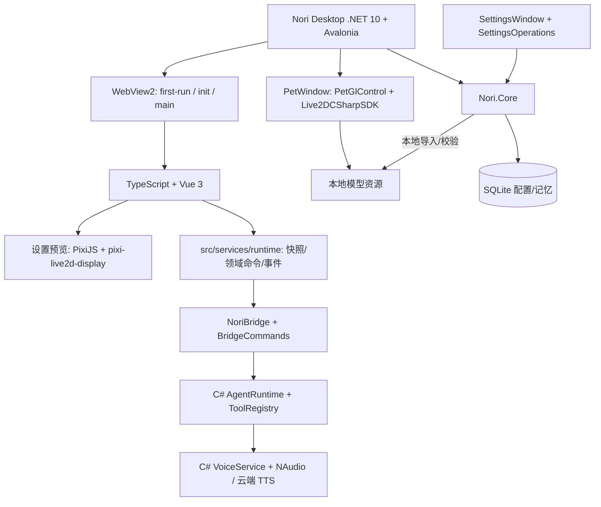

# Nori Desktop Pet 技术

| 模块              | 语言 / 技术              | 负责什么                                         |
| ----------------- | ------------------------ | ------------------------------------------------ |
| **桌宠主程序**    | **.NET 10 + Avalonia**   | 桌面程序/窗口调度/托盘/桥接命令/本地数据库/日志 |
| **桌宠渲染**      | **C# (Live2DCSharpSDK)** | Avalonia 原生 OpenGL 渲染/逐像素透明/行为管线/拖拽与点击交互 |
| **前端 UI**       | **TypeScript + Vue 3**   | 聊天/主页/模型管理预览(Vite / Vue Router / vue-i18n), 由 WebView2 承载 |
| **设置预览**      | **TypeScript**           | PixiJS + `pixi-live2d-display`(Cubism 4) 设置页模型预览 |
| **本地存储/配置** | **C# + SQLite**          | `nori.db` 存配置、聊天、记忆、技能、MCP 与可恢复提醒; 秘密由宿主加密保存 |
| **模型/资源管理** | **C#**                   | 本地模型校验/导入/列表/删除; 前端只负责缩略图与 Pixi 视觉预览 |
| **云端 LLM**      | **C# HTTP API**          | OpenAI Chat/Responses、Anthropic、Google GenAI、流式响应与模型列表 |
| **AI Agent**      | **C# (`Nori.Core`)**     | Agent Loop/JSON 协议/Tool Calling/上下文/授权/取消/对话落库 |
| **记忆系统**      | **C# + SQLite**          | 长期记忆、Embedding、混合检索与重建 |
| **技能 / MCP**    | **C#**                   | 技能 Prompt 注入、URL 安全导入、MCP stdio/SSE 与动态工具注册 |
| **语音 Runtime**  | **C# + NAudio**          | 云端 TTS/Whisper、原生播放队列、录音与口型音量采样 |
| **前端 Runtime**  | **TypeScript**           | `services/runtime` 只做 DTO/事件投影与 typed bridge, 不持有业务真相 |
| **原生设置界面**  | **Avalonia 原生控件**   | 独立 `SettingsWindow` 承载八个设置页，直接调用 `SettingsOperations` 与脱敏快照 |

## 核心流程



## 桌宠窗口透明度 (阶段 0 验证结论)

桌宠窗口要的是**逐像素 alpha + 透出桌面**, 这是 .NET 重构里唯一的生死项, 已用探针程序客观验证 (GDI `GetPixel` 直接读 DWM 合成后的屏幕像素, 非肉眼判断).

验证环境: Windows 10 19045 / .NET 10.0.203 / Avalonia 12.1.1 / Avalonia.Controls.WebView 12.1.0 / WebView2 Evergreen 151.0.4129.78.

配置: `Window` 设 `WindowDecorations=None` + `Background=Transparent` + `TransparencyLevelHint=[Transparent]` + `Topmost`, 内含 `NativeWebView` 且 `Background=Transparent`; 页面 `html,body{background:transparent}`, WebGL 上下文 `alpha:true` 且 `clearColor(0,0,0,0)`.

结果 (探针窗口盖在洋红参照窗口之上, 沿窗口中心横向扫描):

| 采样位置 | 读数 | 含义 |
| --- | --- | --- |
| 窗口外 | `rgb(255,0,255)` | 参照窗口可读, 采样机制可信 |
| 窗口内空白区 | `rgb(255,0,255)` | **逐像素透明生效**, 透出了背后的桌面 |
| 窗口内圆心 | `rgb(0,182,0)` | WebGL 内容正常渲染 |

帧率 75fps (等于显示器刷新率, 无掉帧).

**结论: 默认 HWND 宿主模式即可, 不需要 `ExperimentalOffscreen`, 也不需要自建 Win32 分层 / DirectComposition 宿主.** 本机 `WebViewAdapterInfo.GetAdapterInfo(WebView2)` 报告 `SupportedScenarios = NativeControlHost`, 本就没有 OffscreenRenderer 可用.

两个 Avalonia 12 注意事项:

- `Window.SystemDecorations` 已更名为 `WindowDecorations`, 同名枚举被移除, 旧属性仅保留为 Obsolete.
- `NativeControlHost` (WebView 依赖它) 要求应用 manifest 里带 `<compatibility>` 的 `<supportedOS>` 列表, 否则抛 `Unable to create child window for native control host`.

## Agent 约定

Agent Loop 已在 C# 后端执行; WebView 只订阅事件并渲染气泡/授权弹窗。前端通过 `chat_start` 启动会话, 通过 `chat_cancel` 与 `approval_respond` 控制当前会话。

```json
{
  "type": "message",
  "text": "你好呀。",
  "emotion": "happy",
  "action": "smile"
}
```

```json
{
  "type": "message",
  "text": ""
}
```

```json
{
  "type": "tool_call",
  "name": "addMemory",
  "arguments": {
    "content": "用户喜欢和 Nori 聊天",
    "importance": 0.8
  }
}
```
