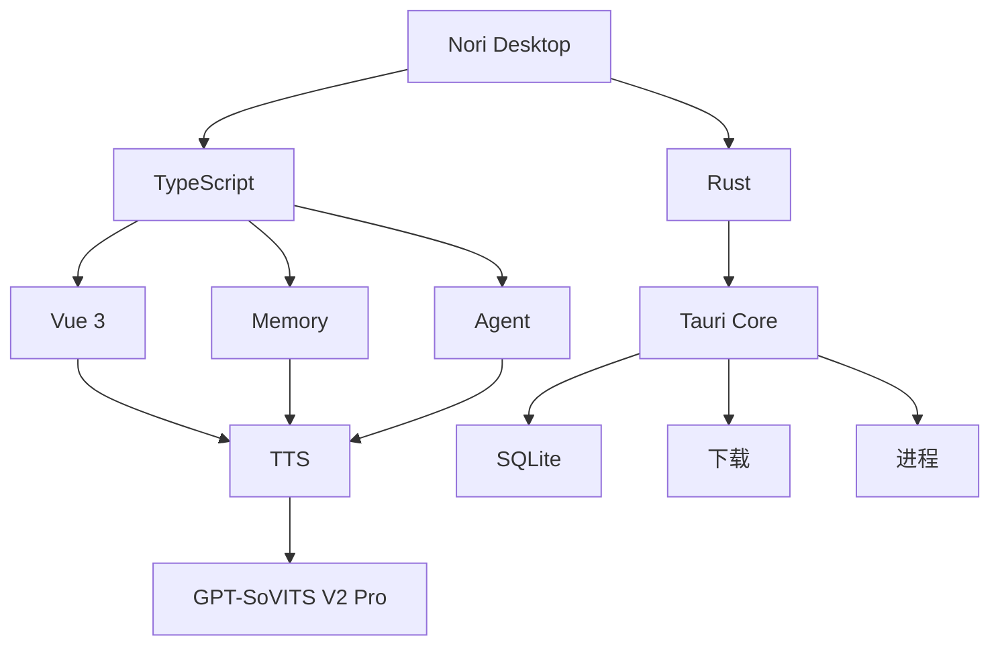

# Nori Desktop Pet 技术

| 模块              | 语言 / 技术              | 负责什么                                    |
| ----------------- | ------------------------ | ------------------------------------------- |
| **桌宠主程序**    | **Rust + Tauri**         | 跨平台桌面程序、系统能力、进程管理          |
| **UI**            | **TypeScript + Vue 3**   | 桌宠界面、聊天、设置、Live2D                |
| **Live2D**        | **TypeScript**           | Cubism SDK Web / Live2D 渲染与控制          |
| **AI Agent**      | **TypeScript**           | Agent Loop、JSON 协议、Tool Calling、上下文 |
| **记忆系统**      | **TypeScript + SQLite**  | 短期/长期记忆、向量检索                     |
| **TTS Runtime**   | **Python**               | GPT-SoVITS V2 Pro 推理                      |
| **GPT-SoVITS**    | **Python**               | Nori TTS 模型                               |
| **本地通信**      | **HTTP / WebSocket**     | 桌宠 ↔ TTS Worker                           |
| **云端 LLM**      | **HTTP / WebSocket API** | 调用 GPT 等模型                             |
| **模型/资源管理** | **Rust**                 | 下载、校验、更新、删除模型                  |

## 核心流程



## Agent约定

```json
{
  "type": "message",
  "text": "你好呀。",
  "emotion": "happy",
  "l2dAction": "smile"
}
```

```json
{
  "type": "message",
  "text": ""
}
```

```json
{
  "type": "tool_call",
  "name": "addMemory",
  "arguments": {
    "content": "用户喜欢和 Nori 聊天",
    "importance": 0.8
  }
}
```
