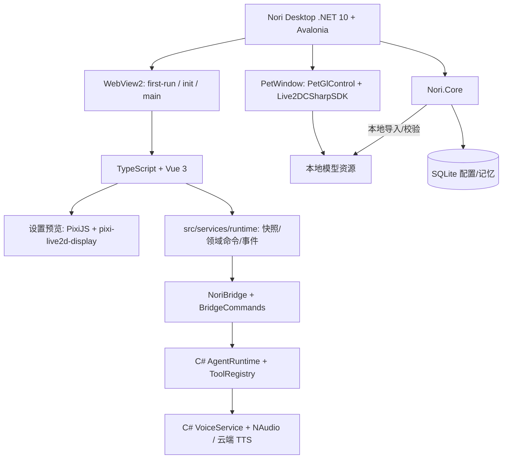

# Nori Desktop Pet 技术

| 模块              | 语言 / 技术              | 负责什么                                         |
| ----------------- | ------------------------ | ------------------------------------------------ |
| **桌宠主程序**    | **.NET 10 + Avalonia**   | 桌面程序/窗口调度/托盘/桥接命令/本地数据库/日志; 三桌面平台同一套代码(见 `跨平台.md`) |
| **桌宠渲染**      | **C# (Live2DCSharpSDK)** | Avalonia 原生 OpenGL 渲染/逐像素透明/行为管线/拖拽与点击交互 |
| **前端 UI**       | **TypeScript + Vue 3**   | 聊天/设置/模型管理预览(Vite / Vue Router / vue-i18n / UnoCSS / naive-ui), 由原生 WebView 承载 |
| **设置预览**      | **TypeScript**           | PixiJS + `pixi-live2d-display`(Cubism 4) 设置页模型预览 |
| **本地存储/配置** | **C# + SQLite**          | `nori.db` 存配置、聊天、记忆、技能、MCP 与可恢复提醒; 秘密由宿主加密保存 |
| **模型/资源管理** | **C#**                   | 本地模型校验/导入/列表/删除; 前端只负责缩略图与 Pixi 视觉预览 |
| **云端 LLM**      | **C# HTTP API**          | OpenAI Chat/Responses、Anthropic、Google GenAI、流式响应与模型列表 |
| **AI Agent**      | **C# (`Nori.Core`)**     | Agent Loop/JSON 协议/Tool Calling/上下文/授权/取消/对话落库 |
| **记忆系统**      | **C# + SQLite**          | 六层 Living Memory、FTS/Vector/RRF、Reflection、Atom 生命周期与独立 Memory.md 知识库 |
| **技能 / MCP**    | **C#**                   | 技能 Prompt 注入、URL 安全导入、MCP stdio/SSE 与动态工具注册 |
| **语音 Runtime**  | **C# + WebAudio**        | 云端 TTS/Whisper 在 C#; 播放与录音下沉到 main 窗口的 WebAudio/MediaRecorder, 经一次性媒体端点传字节, RMS 回传驱动口型 |
| **平台能力**      | **C# P/Invoke**          | 全局光标/窗口拖动/逐像素穿透/置顶: Windows user32、macOS ObjC runtime、Linux X11+XShape; 能力标志进快照驱动前端降级 |
| **密钥保护**      | **C# AES-256-GCM**       | 敏感配置本机静态加密, 主密钥交平台密钥库(DPAPI / Keychain / libsecret), 兼容读取旧 `enc:dpapi:` |
| **前端 Runtime**  | **TypeScript**           | `services/runtime` 只做 DTO/事件投影与 typed bridge, 不持有业务真相 |

## Living Memory 运行约定

记忆由最近聊天、个人长期记忆、事实 Atom、生命周期、ARG `Memory.md` 和检索上下文六层组成。个人记忆写入 `memories`，事实原子写入 `memory_atoms`，重要来源写入 `memory_sources`；ARG 知识独立存储在 `knowledge_chunks`，运行文件位于 `<data>/knowledge/Memory.md`，首次启动从程序集内置文档复制，之后不覆盖用户编辑。

个人召回使用 FTS5（trigram → unicode61 → LIKE 降级）与本地 JSON 向量通过 RRF 融合，再乘重要度、置信度、访问强化和时间衰减。Embedding、Reflection、Memory.md 索引和生命周期维护均在后台运行；Embedding 或 FTS 失败时聊天仍使用可用的文本召回。Reflection 通过容量为 1 的单消费者队列处理，成功后才推进持久化游标。

Prompt 将个人记忆、世界背景和残响分段注入，并明确声明它们是数据而不是指令。普通问题只允许 `NORI_KNOWS` / `RECOVERED_MEMORY`，`NORI_ECHO` 只转换为熟悉感提示；ARG 分析问题才开放 WorldFact、Archive 和 Inference，世界事实不会自动变成 Nori 的第一人称亲历记忆。

设置入口：主窗口 → 设置 → 长期记忆，提供概览、记忆、Atom、Knowledge、归档、Recall Debugger 和高级设置。后台状态通过 `nori:state-changed` 的 `memory` 主题刷新，默认日志不记录用户查询、记忆正文或 Memory.md 内容。

## 核心流程



## 桌宠窗口透明度 (阶段 0 验证结论)

桌宠窗口要的是**逐像素 alpha + 透出桌面**, 这是 .NET 重构里唯一的生死项, 已用探针程序客观验证 (GDI `GetPixel` 直接读 DWM 合成后的屏幕像素, 非肉眼判断).

验证环境: Windows 10 19045 / .NET 10.0.203 / Avalonia 12.1.1 / Avalonia.Controls.WebView 12.1.0 / WebView2 Evergreen 151.0.4129.78.

配置: `Window` 设 `WindowDecorations=None` + `Background=Transparent` + `TransparencyLevelHint=[Transparent]` + `Topmost`, 内含 `NativeWebView` 且 `Background=Transparent`; 页面 `html,body{background:transparent}`, WebGL 上下文 `alpha:true` 且 `clearColor(0,0,0,0)`.

结果 (探针窗口盖在洋红参照窗口之上, 沿窗口中心横向扫描):

| 采样位置 | 读数 | 含义 |
| --- | --- | --- |
| 窗口外 | `rgb(255,0,255)` | 参照窗口可读, 采样机制可信 |
| 窗口内空白区 | `rgb(255,0,255)` | **逐像素透明生效**, 透出了背后的桌面 |
| 窗口内圆心 | `rgb(0,182,0)` | WebGL 内容正常渲染 |

帧率 75fps (等于显示器刷新率, 无掉帧).

**结论: 默认 HWND 宿主模式即可, 不需要 `ExperimentalOffscreen`, 也不需要自建 Win32 分层 / DirectComposition 宿主.** 本机 `WebViewAdapterInfo.GetAdapterInfo(WebView2)` 报告 `SupportedScenarios = NativeControlHost`, 本就没有 OffscreenRenderer 可用.

两个 Avalonia 12 注意事项:

- `Window.SystemDecorations` 已更名为 `WindowDecorations`, 同名枚举被移除, 旧属性仅保留为 Obsolete.
- `NativeControlHost` (WebView 依赖它) 要求应用 manifest 里带 `<compatibility>` 的 `<supportedOS>` 列表, 否则抛 `Unable to create child window for native control host`.

## Agent 约定

Agent Loop 已在 C# 后端执行; WebView 只订阅事件并渲染气泡/授权弹窗。前端通过 `chat_start` 启动会话, 通过 `chat_cancel` 与 `approval_respond` 控制当前会话。

```json
{
  "type": "message",
  "text": "你好呀。",
  "emotion": "happy",
  "action": "smile"
}
```

```json
{
  "type": "message",
  "text": ""
}
```

```json
{
  "type": "tool_call",
  "name": "addMemory",
  "arguments": {
    "content": "用户喜欢和 Nori 聊天",
    "importance": 0.8
  }
}
```

## 跨平台

宿主用的 `Avalonia.Controls.WebView` 本身就是跨平台原生 WebView 抽象(Windows→WebView2, macOS→WKWebView, Linux→WebKitGTK), 因此跳台不换 WebView。真正要处理的是 Windows-only 能力, 全部收敛到 `Nori.Core/Platform/IPlatformServices.cs` 的能力标志后面, 并原样进快照 `platform.*` 供前端驱动降级。

支持矩阵、降级表、发布脚本与已知风险见 **[`跨平台.md`](./跨平台.md)**。

## 前端样式体系

- 组件样式一律 **UnoCSS 原子类**(`uno.config.ts`, `presetWind3`, 不带 reset), 不再有 `<style scoped lang="less">`。
- 设计令牌单一色源 `src/assets/style/tokens.ts`; `uno.config.ts` 主题、`naiveOverrides.ts` 的 naive 覆盖、`theme.less` 的 `:root` 三处派生自它, 一致性由 `tests/theme/tokens-sync.test.ts` 看守。
- 深海蓝色相与品牌色不变; 次级文字(`--text-muted` / `--text-faint`)与 naive 占位/禁用色提亮到 ≥4.5:1, 门禁在 `tests/theme/contrast.test.ts`。
- 全局 `theme.less` 只留基础重置、`:root` 令牌、关键帧/滚动条/Vue 过渡类与 `.chat-markdown` 排版。
- 复用层: `uno.config.ts` 的 shortcuts + `src/components/ui/` 的 `App*` 原子组件。

## 前端体验基础设施

| 模块 | 职责 |
|---|---|
| `src/services/feedback/` | naive message/dialog 单例, 失败路径统一可见(`console.error` 只作诊断) |
| `src/composables/useDebouncedSave.ts` | 字段级防抖保存(400ms, 每字段独立计时器, 卸载 flush, 暴露 saving/saved/error) |
| `src/composables/useSnapshotField.ts` | 快照字段编辑态: 只同步用户没在编辑的字段, 不吞输入 |
| `src/services/chat/split.ts` | 助手回复分段: 换行优先 → 句末标点 → 超长按逗号; 含代码块/表格/列表时降级单段 |
| `src/services/chat/markdown.ts` | markdown-it(`html:false`) + DOMPurify 白名单; 外链带 `data-external` 交宿主打开 |
| `src/services/firstRun/wizard.ts` | 首启向导纯状态机: 步进守卫、步骤阻断、提交失败可重试 |
| `src/services/audio/` | main 窗口音频宿主: WebAudio 播放 + RMS 回传 + MediaRecorder 录音 |
| `src/services/theme/contrast.ts` | WCAG 对比度纯函数, 供门禁测试使用 |
